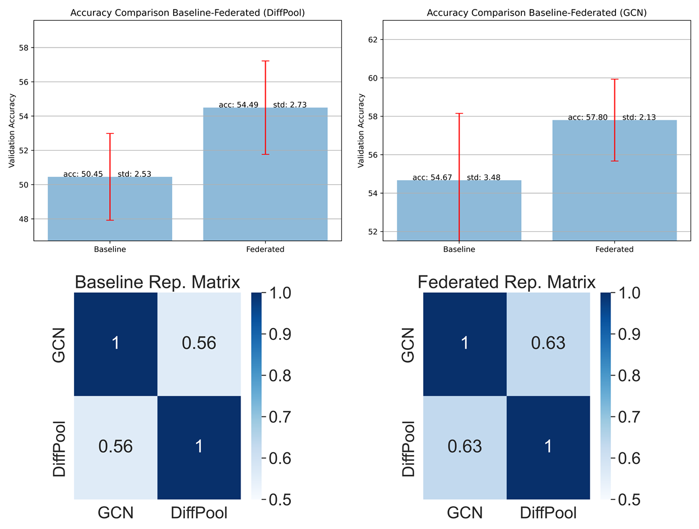

# Federated Reproducibility
How to increase the model accuracy and reproducibility in terms of top discriminative features when learning from heterogeneous decentralized datasets?
Please contact (ygtbalik@gmail.com) for inquiries. Thanks.


# Introduction
This work is accepted at the PRIME workshop in MICCAI 2022.
> **Investigating the Predictive Reproducibility of Federated Graph Neural Networks using Medical Datasets**
>
> [Mehmet Yiğit Balık](https://github.com/YigitBalik)<sup>1</sup>, Arwa Rekik<sup>2</sup>, [Islem Rekik](https://basira-lab.com/)<sup>1</sup>
> 
> <sup>1</sup>BASIRA Lab, Faculty of Computer and Informatics, Istanbul Technical University, Istanbul, Turkey
> 
> <sup>2</sup>Faculty of Medicine of Sousse, Sousse, Tunisia
>
> **Abstract:** *Graph neural networks (GNNs) have achieved extraordinary enhancements in various areas including the fields  medical imaging and  network neuroscience where they displayed a high accuracy in diagnosing challenging neurological disorders such as autism. In the face of medical data scarcity and high-privacy, training such data-hungry models remains challenging. Federated learning brings an efficient solution to this issue by allowing to train models on multiple datasets, collected independently by different hospitals, in fully data-preserving manner. Although both state-of-the-art GNNs and federated learning techniques focus on boosting  classification accuracy, they overlook a critical unsolved problem: investigating the reproducibility of the most discriminative biomarkers (i.e., features) selected by the GNN models within a federated learning paradigm. Quantifying the reproducibility of a predictive medical model against perturbations of training and testing data distributions presents one of the biggest hurdles to overcome in developing translational clinical applications. To the best of our knowledge, this presents the first work investigating the reproducibility of federated GNN models with application to classifying medical imaging and brain connectivity datasets. We evaluated our framework using various GNN models trained on medical imaging and connectomic datasets. More importantly, we showed that federated learning boosts both the accuracy and reproducibility of GNN models in such medical learning tasks.*

## Code
The codewas implemented using Python 3.8 (Anaconda), PyTorch 1.7.1 on Windows and Linux. GPU is not required to run the code.

## Installation 
### *Anaconda Installattion*
* Go to https://repo.anaconda.com/archive/
* Download version for your system (We used Python 3.8  on 64bit Windows 10)
* Install the platform
* Create a conda environment by typing:  ```conda create --name reproducibleFedGNN python=3.8 ```

### *Dependency Installattion*
Copy and paste the following commands to install all packages (CPU version)
```sh
$ conda activate reproducibleFedGNN
$ pip install numpy
$ pip install matplotlib
$ pip install pandas
$ pip install scikit-learn
$ pip install seaborn
$ pip install torch==1.7.1+cpu torchvision==0.8.2+cpu torchaudio==0.7.2 -f https://download.pytorch.org/whl/torch_stable.html
$ pip install torch-scatter==2.0.6 -f https://data.pyg.org/whl/torch-1.7.1+cpu.html
$ pip install torch-sparse==0.6.9 -f https://data.pyg.org/whl/torch-1.7.1+cpu.html
$ pip install torch_geometric==1.7.1
$ pip install medmnist
```
These instructions are for CPU installation. If you want GPU installation, please visit (optional) PyTorch-Geometric’s web page (https://pytorch-geometric.readthedocs.io/en/latest/notes/installation.html) for description on installing GPU version. Code will check the version of dependencies and availability of GPU. If everything is configured correctly, it will utilize GPU automatically.

## Data format
In case you want to use our framework, the input dataset should be a list of numpy arrays. Each numpy array is of size (n_r, n_r, n_v), where n_r and n_v are the number of regions and views, respectively. Our framework works with only one view. If you have multi-view graph please indicate the view by command line argument ```--view=VIEW_INDEX```. We provided a data simulation coda in the python file ```simulate_data.py```. If you want to use your dataset, you should put your data into the data folder and set command line argument ```--dataset=Folder_Name_of_Your_Dataset```. 

### Usage of image based datasets ([MedMNIST](https://medmnist.com/))
#### Image matrix as the input
The image should be square and grayscale to satisfy (n, n, 1) format where n is number of rows and columns.
#### Weighted connectivity matrix as the input
784x784 connectivity matrix (8-connected) is built and given as inputs to models. The weight of the connectivity link is determined by the absolute differences of two adjacent pixels. Heatmap of pixel weights can be plotted if the input type is the connectivity matrix.

The input type can be changed via options (for image based datasets only):
* ```--input_type=image``` to input as image matrix
* ```--input_type=adj``` to input as weighted connectivity matrix


## Run federated reproducibility framework
After creating a simulated dataset, you can run the GNN models by running ```demo.py``` file in your activated ```reproducibleFedGNN``` environment. 
```sh
$ conda activate reproducibleFedGNN
$ python demo.py
```

## GNN models
The GNN models included are:
| Model | Paper |
| ------ | ------ |
| DiffPool | https://arxiv.org/abs/1806.08804 |
| GCN | https://arxiv.org/abs/1609.02907 |

## Main components of our Code
| Component | Content |
| ------ | ------ |
| options.py | Includes hyperparameter and other options. You may modify it according to your needs. |
| demo.py | The main driver code. |
| fed_localmodel.py | Contains the implementation of the local model and federated averaging.  |
| learning_modes.py | Contains the implementation of both federated and non-federated (baseline) learning.  |
| fed_accuracy.py | It creates the plots of losses and accuracy comparison concerning one specific model.  |
| fed_reproducibility.py | It creates the heatmaps of reproducibility matrices.  |
| data/ | Contains dataset folders. |
| results/ | Contains plots after execution. | 

results/ directory automatically created by demo.py

## Essential arguments 

| Argument                   | Explanation                          |
| -------------------------- | ------------------------------------ |
| dataset                    | Name of the dataset (default: 'Demo')|
| input_type                 | Input type option of image data (options: \['image', 'adj'], default: 'image')|
| view                       | Index of view for multi-view graphs (default: 0)|
| comms_round                | Number of communication rounds between local models and the global model (default: 5) |
| hospital_num               | Number of hospitals (default: 3) |
| num_epochs                 | Number of epochs (default: 100) |


## Example Results

The figure demonstrates an example accuracy comparisons and average reproducibility matrices of federated method to baseline method for the models (DiffPool and GCN) for a demo data with 200 subjects (equally partitioned between two classes) where each subject represented by a 35x35 matrix.


The figure shows the learned weights of the features by the most reproducible model.

## YouTube videos to install and run the code and understand how federated reproducibility works

To install and run federeated reproducibility, check the following YouTube video: 


To learn about how federated reproducibility works, check the following YouTube video: 


# Federated reproducibility paper on arXiv


# Please cite the following paper when using federated reproducibility:

```latex

```
# Credits
* Federated learning technique is built on [RG-Select](https://github.com/basiralab/RG-Select) framework.

## Related references
Georges, N., Mhiri, I., Rekik, I., Initiative, A.D.N., et al.: Identifying the best data-driven feature selection method for boosting reproducibility in classification tasks. Pattern Recognition 101 (2020) 107183

Nebli, A., Gharsallaoui, M.A., Gurler, Z., Rekik, I., Initiative, A.D.N., et al.: Quantifying the reproducibility of graph neural networks using multigraph data representation. Neural Networks 148 (2022) 254–265

McMahan, B., Moore, E., Ramage, D., Hampson, S., y Arcas, B.A.: Communicationefficient learning of deep networks from decentralized data. In: Artificial intelligence and statistics, PMLR (2017) 1273–1282

